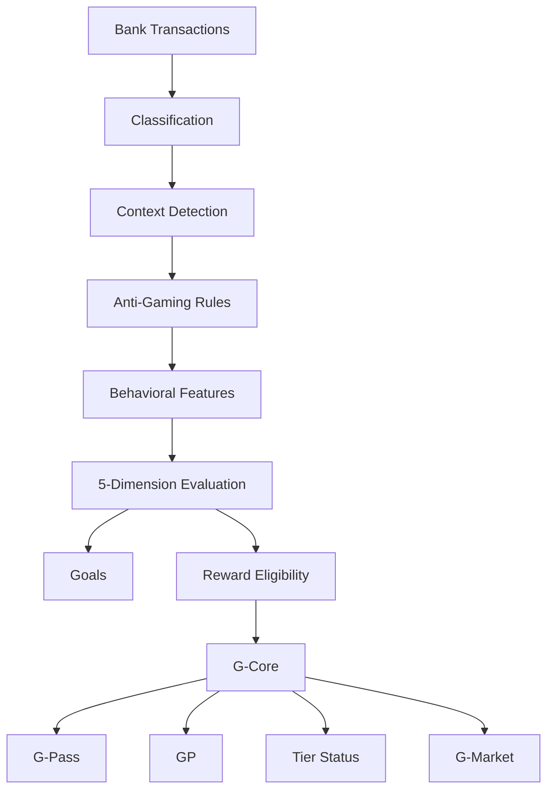

# G-Core

### Behavioral Banking Loyalty Infrastructure

> “We don't reward wealth. We reward financial consistency in context.”

Built by Team EMPTY at Adria Hack Sarajevo 2026.

[**🌐 Live GitHub Pages Demo**](https://kantimohanthy.github.io/Team-Empty-Sarajevo-Hackathon/)

`Next.js 14` · `React` · `TypeScript` · `Tailwind CSS` · `SQLite` · `Recharts` · `Framer Motion` · `GitHub Actions` · `GitHub Pages`

---

## 💡 The Problem

Many traditional banking loyalty programs reward transaction volume, credit card debt, or large account balances — favoring high-income or high-spending accounts while ignoring consistent, responsible money management.

**G-Core** explores whether financial consistency — measured within a customer's own historical baselines and personal financial context — can serve as a meaningful loyalty signal instead.

*Note: This repository is a hackathon prototype demonstrating an alternative loyalty concept. It is not an empirical claim that traditional loyalty models are universally flawed or that this prototype has been scientifically validated across institutional cohorts.*

---

## 🛠️ What We Built

Confirmed features implemented in this repository:

* **Interactive Customer Banking Interface**: Explore real-time budget tracking, categorical spending breakdowns, and personalized goals (`/bank` and `/ecosystem`).
* **5-Dimension Deterministic Behavioral Engine**: Calculates an overall behavioral evaluation score based on five weighted consistency metrics (`lib/server/behavior-engine.ts`).
* **Protected Healthcare Expense Filter**: Identifies protected categories (such as emergency medical care) so that unavoidable health expenses do not distort discretionary budget scoring.
* **Anti-Gaming Matching-Transfer Filter**: Detects same-customer internal transfers between accounts and excludes matching inflow/outflow pairs from savings/progress metrics (`lib/server/anti-gaming-engine.ts`).
* **Personalized Goals & Reward Eligibility Engine**: Dynamically matches customers to reward campaigns based on consistency criteria rather than spending thresholds (`lib/server/reward-engine.ts`).
* **G-Core Points (GP) & Tier Progression**: Accrues GP for goal milestones and advances network tiers from Member up to Diamond (`lib/server/gcore-engine.ts`).
* **G-Market Perks Catalog & Claiming System**: Enables customers to redeem GP for exclusive perks, access passes, and experiences with real-time inventory scarcity tracking.
* **Pseudonymous G-Pass Identity Hashing**: Generates a deterministic SHA-256 pseudonymous identifier (`G-HEXSHA256`) to demonstrate privacy-preserving cross-bank portability.
* **Bank Admin Intelligence Console**: Real-time event stream, portfolio risk segmentation, and campaign fit audit log (`/bank-admin`).
* **Interactive Simulation Engine**: Triggerable interactive actions to simulate month completion, healthcare expenses, internal transfers, and bank-switching live in the browser.
* **Browser-Side Static Demo Mode**: Zero-backend static state engine with `localStorage` persistence, allowing the full app to run statically on GitHub Pages.

---

## 🔄 Product Flow

```
Banking Activity
  ➔ Context Detection
  ➔ Anti-Gaming Filtering
  ➔ Behavioral Features
  ➔ Behavioral Evaluation
  ➔ Personalized Goals
  ➔ Rewards + GP
  ➔ G-Core Status
```

1. **Banking Activity**: Daily transactions, recurring bill payments, and savings transfers occur at the customer's primary bank.
2. **Context Detection**: Categorizes transactions into essential, discretionary, or protected categories (e.g., healthcare).
3. **Anti-Gaming Filtering**: Scans candidate transactions for matching opposite-direction internal transfers to filter out artificial activity.
4. **Behavioral Features**: Extracts 5 normalized behavioral metrics relative to 3-month personal historical medians.
5. **Behavioral Evaluation**: Evaluates overall consistency using an explainable, weighted scoring model.
6. **Personalized Goals**: Sets dynamic monthly targets and evaluates completion status (`ON_TRACK`, `AT_RISK`, `ACHIEVED`).
7. **Rewards + GP**: Consistent habits earn GP points and unlock targeted partner offers.
8. **G-Core Status**: Updates the customer's pseudonymous G-Pass network status, preserving earned tier standing across network institutions.

---

## 📊 Behavioral Model

The core evaluation logic uses five weighted dimensions:

| Dimension | Weight | Description |
| :--- | :---: | :--- |
| **Budget Discipline** | `30%` | Staying within personalized discretionary spending targets |
| **Payment Consistency** | `25%` | On-time settlement of fixed obligations (rent, utilities, loans) |
| **Savings Consistency** | `20%` | Regular monthly net savings contributions, regardless of absolute magnitude |
| **Liquidity Resilience** | `15%` | Maintaining a positive account buffer without overdraft events |
| **Goal Consistency** | `10%` | Multi-month streak adherence and milestone progress |

> [!IMPORTANT]
> **Prototype Note**: These weights are design parameters selected for the hackathon MVP. They are not empirically calibrated banking-risk coefficients or credit-scoring models. G-Core is a behavioral evaluation and reward-selection layer, not a credit score.

---

## 🛡️ Context-Aware Examples

### 1. Healthcare Expense Protection
When a customer incurs an unexpected healthcare expense (e.g., €450 medical care), the context engine flags the transaction as `protectedFlag: true`. The expense is excluded from discretionary budget calculations so the customer is not unfairly penalized for an essential health event.

### 2. Internal Transfer Anti-Gaming
If a user transfers €500 from Checking to Savings and shortly after transfers €500 back to Checking, the anti-gaming engine detects the matching magnitude and opposite direction within the transfer window. Both legs are assigned `excludedForGaming: true` and excluded from savings progress metrics.

---

## 🏗️ Architecture & Privacy Boundary



### Privacy Boundary

```
BANK SIDE (Stays inside financial institution):
  - Customer identity & PII
  - Account balances
  - Raw transaction logs
  - Merchant names & timestamps

G-CORE SIDE (Exposed to loyalty ecosystem):
  - Pseudonymous G-Pass ID (e.g., G-8F3A9C10)
  - Accumulated GP point balance & deltas
  - Network status tier (Member ➔ Diamond)
  - Reward eligibility flags
  - Ecosystem tenure months
```

> [!NOTE]
> The intended production architecture keeps raw banking data bank-side and exposes only minimum derived ecosystem state to G-Core.

---

## 🔍 What Is Real vs Simulated

### Implemented
* Complete 5-dimension deterministic behavioral evaluation engine (`lib/server/behavior-engine.ts`).
* Automated same-day internal transfer anti-gaming rule (`lib/server/anti-gaming-engine.ts`).
* Essential vs. discretionary transaction classification rules (`lib/server/classification-engine.ts`).
* Pseudonymous G-Pass hash generator (`lib/server/gcore-engine.ts`).
* G-Market perk catalog and item claim transaction system (`lib/server/gcore-engine.ts`).
* Client-side state simulation engine with `localStorage` persistence (`lib/demo-engine.ts`).
* Interactive bank-switching simulation demonstrating local point reset vs. network status preservation (`/ecosystem/passport`).
* Responsive Next.js 14 frontend pages with static export support (`next.config.js`).

### Simulated
* Demo customer transaction records ("Alex Mercer" dataset in `lib/mock-data.ts`).
* Bank-wide portfolio analytics on `/bank-admin` (enrolled cohort size, churn rates, offer redemption rates).
* Multi-bank network scale metrics on `/network`.
* Merchant partner ecosystem availability and reward item inventory counts.

### Production Requirements
To deploy G-Core in a production banking environment, the following infrastructure layers would be required:
1. **Core Banking / Open Banking Integration**: Read-only OAuth2 / Open Banking PSD2 API connectors.
2. **Authentication & Authorization**: Enterprise IAM, mTLS, and RBAC controls.
3. **Encryption & Key Management**: Hardware Security Modules (HSM) for G-Pass salt/key management.
4. **Privacy & Regulatory Assessment**: GDPR / CCPA compliance reviews and data-protection impact assessments (DPIA).
5. **Security & Penetration Testing**: Third-party code audits, SOC2 certification, and vulnerability testing.
6. **Fairness & Model Validation**: Statistical calibration of behavioral weights across diverse demographic cohorts.
7. **Institutional Audit Logging**: Immutable, cryptographically signed audit logs for institutional compliance.

---

## 🧠 Why Deterministic Instead of ML?

The MVP intentionally uses **deterministic and explainable rules** rather than a black-box machine-learning model. During a 24-hour hackathon, labeled longitudinal financial outcome data was not available to train or validate a predictive ML model responsibly.

Advantages of a deterministic rule-based approach:
* **Fully Auditable**: Every score, rule exclusion, and reward decision can be inspected line-by-line.
* **Transparent to Customers**: Customers can clearly understand *why* a goal was met or why a healthcare expense was protected.
* **Reproducible**: Given identical transactions, the engine yields identical evaluation results without model drift.
* **Strong Baseline**: Establishes a clean benchmark for future probabilistic modeling.

---

## 🔮 Future Modeling Roadmap

As longitudinal customer dataset size grows, future iterations of G-Core could introduce predictive machine learning models:

* **Supervised Transaction Classification**: Fine-tuned NLP/transformer models to classify ambiguous merchant strings into standard categories.
* **Gradient Boosting (LightGBM / XGBoost)**: Predicting monthly budget variance or account deficit risks based on time-series features.
* **Anomaly Detection**: Unsupervised isolation forests to detect novel financial fraud or complex multi-account gaming patterns.
* **HDBSCAN Clustering**: Exploratory clustering of customer spending behaviors to identify emerging financial personas.
* **Contextual Bandits**: Reinforcement learning algorithms to optimize personalized reward recommendations based on historical conversion rates.
* **SHAP / Reason Codes**: Explanatory frameworks to ensure any future ML predictions remain transparent and interpretable.

> *Future predictive models should only be introduced after sufficient longitudinal data and proper institutional validation exist.*

---

## 📝 Worked Example

Consider a customer earning **€1,000 / month**:

1. **Healthcare Expense (€450)**: Recognized as a protected health category (`protectedFlag: true`). Excluded from discretionary budget calculations so discretionary spending target is not breached.
2. **Internal Transfer (€500)**: Transferred out and back within 24 hours. Detected by anti-gaming engine (`excludedForGaming: true`). Excluded from savings progress.
3. **Rent Payment (€400)**: Evaluated under **Payment Consistency** (25% weight).
4. **Discretionary Spending (€150)**: Evaluated against discretionary target under **Budget Discipline** (30% weight).

---

## 🖼️ Visual Documentation

<!-- TODO: Add Customer App screenshot -->
<!-- TODO: Add Bank Admin screenshot -->
<!-- TODO: Add G-Core Ecosystem screenshot -->

*Recommended visual sequence for review:*
1. Customer App (`/bank`)
2. Protected Healthcare Expense Banner
3. Internal Transfer Exclusion Banner
4. G-Core Status Dashboard (`/ecosystem`)
5. G-Market Catalog & Claiming Modal
6. Bank Admin Event Stream Console (`/bank-admin`)

---

## 💻 Core Product Surfaces & Routes

| Surface | Route | Description |
| :--- | :--- | :--- |
| **Customer Bank App** | [`/bank`](file:///h:/sarajevo%20hackathon/5%20merit-loyalty-mvp/app/bank/page.tsx) | XYZ Bank customer account overview, card controls, and recent activity. |
| **G-Core Ecosystem** | [`/ecosystem`](file:///h:/sarajevo%20hackathon/5%20merit-loyalty-mvp/app/ecosystem/page.tsx) | Behavioral score breakdown, monthly goals, and interactive simulation controls. |
| **G-Pass Passport** | [`/ecosystem/passport`](file:///h:/sarajevo%20hackathon/5%20merit-loyalty-mvp/app/ecosystem/passport/page.tsx) | Network tier progression, pseudonymous G-Pass identity, and bank-switch simulation. |
| **G-Market Perks** | [`/ecosystem/rewards`](file:///h:/sarajevo%20hackathon/5%20merit-loyalty-mvp/app/ecosystem/rewards/page.tsx) | Claimable merchant perks, access passes, and GP redemption interface. |
| **Bank Admin Console** | [`/bank-admin`](file:///h:/sarajevo%20hackathon/5%20merit-loyalty-mvp/app/bank-admin/page.tsx) | Portfolio analytics, real-time audit log, and automated campaign fit rationale. |
| **Merit Network Story** | [`/network`](file:///h:/sarajevo%20hackathon/5%20merit-loyalty-mvp/app/network/page.tsx) | Ecosystem architecture visualization and privacy boundary explainer. |

---

## 🎯 Start Here If Reviewing the Code

If you are inspecting the repository logic, these are the core technical files:

1. [`lib/server/behavior-engine.ts`](file:///h:/sarajevo%20hackathon/5%20merit-loyalty-mvp/lib/server/behavior-engine.ts) — Implements the 5-dimension weighted evaluation model.
2. [`lib/server/anti-gaming-engine.ts`](file:///h:/sarajevo%20hackathon/5%20merit-loyalty-mvp/lib/server/anti-gaming-engine.ts) — Detects matching same-day internal transfers.
3. [`lib/server/gcore-engine.ts`](file:///h:/sarajevo%20hackathon/5%20merit-loyalty-mvp/lib/server/gcore-engine.ts) — Handles G-Pass generation, GP points ledger, and G-Market claims.
4. [`lib/server/classification-engine.ts`](file:///h:/sarajevo%20hackathon/5%20merit-loyalty-mvp/lib/server/classification-engine.ts) — Rules for transaction classification.
5. [`lib/server/pipeline.ts`](file:///h:/sarajevo%20hackathon/5%20merit-loyalty-mvp/lib/server/pipeline.ts) — Ingestion & evaluation pipeline orchestration.
6. [`lib/demo-engine.ts`](file:///h:/sarajevo%20hackathon/5%20merit-loyalty-mvp/lib/demo-engine.ts) — Client-side simulation state machine with `localStorage` fallback for static GitHub Pages export.

---

## 📁 Repository Structure

```
app/
├── bank/                # XYZ Customer Bank app view
├── bank-admin/          # Institutional staff analytics console
├── ecosystem/           # G-Core customer loyalty dashboard & pages
│   ├── activity/        # Categorized transaction log
│   ├── goals/           # Monthly goal targets & breakdown
│   ├── passport/        # G-Pass network identity & bank switch demo
│   └── rewards/         # G-Market perk claim catalog
├── network/             # Architecture overview & network metrics
└── api/                 # Next.js API route handlers (SQLite server mode)

lib/
├── server/              # Server-side core engines (behavior, anti-gaming, gcore)
├── demo-engine.ts       # Browser-side static state machine & localStorage persistence
├── demo-context.tsx      # React context provider for demo state
├── gcore-context.tsx     # React context provider for G-Core network state
├── mock-data.ts         # Initial seed dataset (Alex Mercer)
└── types.ts             # Shared TypeScript interface definitions
```

---

## 🏆 Hackathon Context

* **Event**: Adria Hack Sarajevo 2026
* **Dates**: September 12–13, 2026
* **Track**: FinTech
* **Build Duration**: 24 Hours
* **Team**: Team EMPTY

*Built from initial concept through architecture design, core evaluation engine implementation, and static web deployment within 24 hours.*

---

## 👥 Team Attribution

**Team EMPTY** developed G-Core during Adria Hack Sarajevo 2026.

*Individual contribution details can be added by team members.*

---

## ❓ Lessons & Open Questions

1. **Fairness Across Income Levels**: How can behavioral loyalty systems ensure targets adapt fairly to varying income dynamics without penalizing lower-income accounts?
2. **Behavioral Efficacy**: Which specific interventions (e.g., GP rewards vs. tier access) demonstrate the highest long-term engagement and deposit retention?
3. **Ecosystem Economics**: What is the optimal fee/perk sharing model between partner banks and merchant networks to ensure sustainable alignment?

---

## 🚀 Local Development

```bash
# Install dependencies
npm install

# Run development server
npm run dev

# Run TypeScript type check
npm run type-check

# Run Next.js linter
npm run lint

# Build static export for production deployment
set GITHUB_ACTIONS=true&& npm run build
```

Open [http://localhost:3000](http://localhost:3000) to view the app locally.

---

## ⚖️ Disclaimer

*This repository is a hackathon prototype built for demonstration purposes using simulated demo data. It is not a credit-scoring system, lending-decision system, financial advice product, or production banking platform.*
